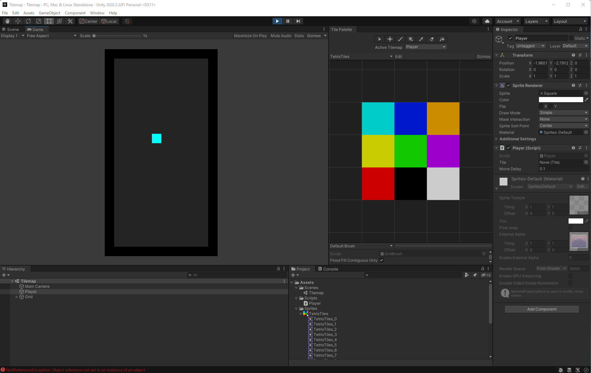

# Tilemap

 Learning Tilemap in Unity
 
 ## Why?
 
 The next game I wanted to program in Unity is Tetris. I found a [tutorial](https://www.youtube.com/watch?v=ODLzYI4d-J8) for making Tetirs. After watching the tutorial, I knew I wasn't ready to implement the game. I first needed to spend some time familarizing myself with [Unity Tilemaps](https://www.youtube.com/watch?v=ryISV_nH8qw). That's the purpose of this simple project.
 
 ## Result?
 
 - Created my own 3x3 sprite (using Gimp)
 - Rendered a container box and background color
 - Simple script to draw a tile on a tilemap with keyboard movement and ensure it doesn't go out of bounds.

## Concepts I encoutered

- `Sprite`, `Sprite Editor`, and auto-slicing sprites in Unity
- `Orthographic Size` in Unity having to do with the *zoom* level on the camera.
- Delaying player movement in `Update()` via `Time.time`
- `Grids` and `Tilemaps` and `Timemap Editor`

## Conclusion

Here's an excellent quote:
> If you can't solve a problem, then there is a easier problem you can solve: find it. - George Pólya (How to solve it)

I made the right call by starting with tilemaps.
